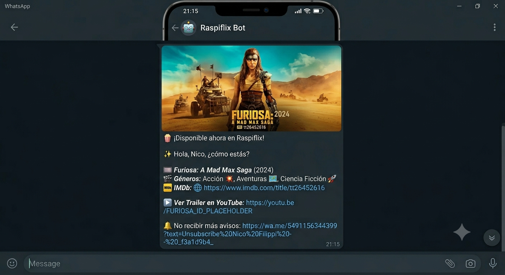

[](https://www.raspberrypi.org/)
[](https://jellyfin.org/)
[](https://www.python.org/)
[](https://fastapi.tiangolo.com/)
[](https://nodejs.org/)
[](https://www.docker.com/)

# 🍿 jellyfin-whatsapp [](https://ko-fi.com/M1N62166OY)

A decoupled, lightweight notification engine built for Raspberry Pi to automatically aggregate newly added media from **Jellyfin** and send structured updates with official poster art to users via **WhatsApp**.



---

## 🏗️ Architecture & Ecosystem

The system features a **decoupled architecture** split into two main containerized microservices sharing a common data directory (`/config`). This design keeps memory footprints exceptionally low on single-board computers like the Raspberry Pi.

- **Backend Engine (`Python / FastAPI`):** Receives instant webhooks from Jellyfin when media is added, buffers requests to prevent message spamming, enforces timezone-aware quiet hours, and matches media profiles with local database users.
- **Gateway Service (`Node.js / whatsapp-web.js`):** Acts as a headless WhatsApp Web client instance. It listens for outgoing data requests from the Python engine to forward media payloads and monitors chat interaction for instant subscription opt-outs.

---

## 🚀 Key Features

- **Smart Message Aggregation:** Instead of flooding users with single texts when a season of a TV show indexes, notifications are batched into a single unified broadcast based on a configurable interval window.
- **Quiet Hours Shield:** Automatically holds back notifications received during late-night hours. Pending media aggregates silently in memory and flushes immediately as a single summary once morning hours kick in.
- **One-Click Unsubscribe Link:** Every single notification message attaches a dynamically-built, native WhatsApp deep-link (`wa.me`) passing a unique cancellation payload.
- **Local-First Architecture:** Eliminates complex database management. Subscriptions and runtime parameters are fully handled via lightweight, localized, system-synced JSON layers.
- **Anti-Ban & Smart Throttling System:** Multi-layered, human-like throttling and randomization strategy across the Python and Node.js layers.

---

## 📂 File Structure

```text
├── app/
│   ├── app.py                  # Main FastAPI Application & Scheduling logic
│   ├── banner.py               # Custom ASCII branding initialization module
│   ├── genres.py               # Media genre categorization to Emoji adapter
│   ├── logger_colors.py        # Thread-safe ANSI terminal log colorizer
│   └── requirements.txt        # Python library dependencies
├── server/
│   ├── server.js               # Node.js gateway & headless whatsapp-web client
│   └── package.json            # Node.js library dependencies
└── config/                     # Shared Docker Shared Volume
    ├── config.json             # Core infrastructure & scheduler rules setup
    ├── users.json              # Local subscription storage database mapping
    └── templates.json          # Message structure templates
```

---

## ⚙️ Configuration Setup

Both environments read core parameters from a single setup file in `/config/config.json`.

```json
{
    "app_name": "Notifications Engine Example",
    "jellyfin": {
        "server_name": "YOUR_SERVER_NAME_HERE",
        "server_url": "http://YOUR_SERVER_URL_HERE:YOUR_PORT_HERE",
        "api_key": "YOUR_API_KEY_HERE"
    },
    "tmdb": {
        "api_key": "YOUR_TMDB_API_KEY_HERE",
        "language": "es",
        "send_trailers": true
    },
    "whatsapp_bot_number": "YOUR_PHONE_NUMBER_HERE",
    "group_interval_seconds": 60,
    "start_hour": 10,
    "end_hour": 22,
    "timezone": "America/Argentina/Buenos_Aires",
    "language": "es"
}
```

### 📱 `whatsapp_bot_number` format

🇦🇷 Argentinian, Buenos Aires phone number `5491155555555` example:

- **54** for international country code.
- **9** for mobile prefix required for international calls mobile lines.
- **11** for Area code.
- **55555555** for unique 8-digit local subscriber number.

---

## 👥 User Subscription Mapping (`/config/users.json`)

Control access manually by populating your subscriber base within this directory structure.

### 🇦🇷 Argentinian phone number examples

```json
[
    {
        "username": "admin",
        "phone": "5491155555555",
        "enabled": true
    },
    {
        "username": "guest",
        "phone": "5491100000000",
        "enabled": false
    }
]
```

---

## 📋 Template Management & Customization

Features a dynamic, decoupled templating system that allows you to fully customize the notification text, layout, and branding without modifying the source code. The configuration is shared between Python (message composition) and Node.js (final payload structural layout) via `/config/templates.json`.

If the file is missing or contains invalid JSON, both services will seamlessly fall back to hardcoded default layouts.

### 📁 `templates.json` Structure

Create or edit the file in your mapped configuration directory using the following structure:

```json
{
  "single_item": "🟪 *New Release on the Platform!*\n\n{👋 Hello |🎉 Greetings |✨ Hey there, }{{user_name}}!\n\n🎞️ *{{title}}{{year_str}}*\n{{genres}}{{imdb_url}}",
  "multiple_items": "🟪 *Catch up on te Platform!*\n\n{👋 Hi |🍿 Hey }{{user_name}}, here is what's new on the server:\n\n{{titles}}",
  "final_structure": "{{caption}}{{trailer}}{{unsubscribe}}"
}
```

### 🔀 Spintax Support (Anti-Ban System)

To simulate human messaging patterns and drastically reduce the risk of being flag-banned by WhatsApp's automated spam detection, the template engines natively support Spintax processing.

- Syntax: `{Option 1|Option 2|Option 3}`
- Behavior: Every time a notification is dispatched to a user, the script randomly picks one of the options inside the curly brackets.
- Example: `{👋 Hello|🎉 Greetings}` will randomly evaluate to `👋 Hello` for one user and `🎉 Greetings` for the next during the exact same notification batch broadcast.

### 🧠 Available Placeholders

#### 1. For `single_item` (When exactly one media item is added)

| Placeholder     | Description                                            | Example Output                          |
| --------------- | ------------------------------------------------------ | --------------------------------------- |
| `{{user_name}}` | The target user's custom username.                     | JohnDoe                                 |
| `{{title}}`     | The core title of the Movie.                           | 🎞️ **Interstellar**                     |
| `{{year_str}}`  | Release year padded with brackets.                     | (2014)                                  |
| `{{genres}}`    | Formatted list of genres containing contextual emojis. | 🚀 Sci-Fi │ 🎭 Drama                    |
| `{{imdb_url}}`  | Preformatted IMDb link with an indicator icon.         | 🌐 https://www.imdb.com/title/tt0816692 |

#### 2. For `multiple_items` (When multiple updates are grouped into a single batch)

| **Placeholder** | **Description**                                         | **Example Output**                                  |
| --------------- | ------------------------------------------------------- | --------------------------------------------------- |
| `{{user_name}}` | The target user's custom username.                      | JohnDoe                                             |
| `{{titles}}`    | A multi-line list containing all grouped media entries. | 🎞️ **Inception (2010)**<br>🎞️ **The Matrix (1999)** |

#### 3. For `final_structure` (Node.js Gateway Stitching)

This string controls the absolute layout arrangement right before transmitting the message payload over WhatsApp Web:

- `{{caption}}` ➜ The resolved message block processed by Python (single_item or multiple_items).
- `{{trailer}}` ➜ The YouTube trailer URL dynamically retrieved from TMDB (if enabled and found).
- `{{unsubscribe}}` ➜ A unique wa.me direct action link including a unique spintax header and randomized request ID.

---

## 🔄 Core Workflows

### 📥 1. Media Webhook Processing

- Jellyfin triggers an `ItemAdded event` and sends a payload to FastAPI (`POST /jellyfin`).
- The payload is securely staged into a thread-safe memory registry pending_items.

### ⏱️ 2. Time-Restricted Aggregator (`Scheduler`)

- The background scheduler evaluates runtime intervals.
- It tracks the designated zone-aware hours (`start_hour` and `end_hour`).
- If it runs out-of-bounds (e.g., 3:00 AM), it safely suspends processing. Staged content remains buffered until the morning.
- When boundaries clear, the content compiles into a single custom design message containing official media posters and automatically forwards it to all users marked "enabled": true.

### 🔕 3. Unsubscribe Lifecycle

- The user clicks the built-in deep link inside their WhatsApp notification message:
  https://wa.me/{bot_number}?text=Unsubscribe%20{user_phone}%20-%20{uuid}
- The user sends the pre-filled text.
- The Node.js service intercepts the command "Unsubscribe <phone> - <uuid>".
- It reads `/config/users.json`, searches for the target number, and flips their permission key to "enabled": false.
- The Python engine instantly recognizes the status mutation on the subsequent iteration loop and skips sending upcoming packages.

### 🛡️ 4. Anti-Ban & Smart Throttling System

Sending automated notifications via WhatsApp Web clients carries an inherent risk of account suspension if the behavior triggers Meta's anti-spam algorithms. To mitigate this, the Notifications Engine implements a multi-layered, human-like throttling and randomization strategy across the Python and Node.js layers.

### Key Defense Mechanisms

- **Message Pooling & Batching (`IntervalTrigger`)**
  Instead of blasting messages instantly every time a single file finishes downloading on Jellyfin (which generates unnatural spikes in activity), incoming webhook payloads are safely locked (`threading.Lock`) and appended to a pending queue. The background scheduler processes and groups these items into a single consolidated digest message at set intervals (e.g., every 3600 seconds).

- **Dynamic Spintax Resolution**
  Sending the exact same string to dozens of users is a surefire way to trigger fingerprinting filters. The template engine utilizes nested Spintax rotation (e.g., `{🍿 ¡Disponible ahora!|🎬 ¡Estreno!}`) to dynamically generate distinct greeting and introduction combinations for every single outgoing message.

- **Unique Message Footprints (UUID Shuffling)**
  Every notification generates an ephemeral 8-character `uuid4` tracking ID injected into the custom WhatsApp chat-deep-link (`wa.me/?text=...`). Because this ID changes per user, no two messages sent in a single batch are byte-for-byte identical, rendering signature-based automated spam filters ineffective.

- **The Anti-Ban Shield (Randomized Jitter Delay)**
  Between every single individual recipient message, the processor applies a dynamic, randomized pause (`random.randint(5, 20)`). This "jitter" effectively breaks rigid timing signatures, perfectly mimicking a human operator typing and sending messages sequentially.

- **Smart Time Window Filtering**
  The system respects natural human circadian rhythms by checking the configured `START_HOUR` and `END_HOUR` relative to the target `TIMEZONE`. Messages queued outside this window are automatically deferred, preventing anomalous midnight broadcasting.

- **Session Persistence via `LocalAuth`**
  The underlying Node.js `whatsapp-web.js` service stores persistent session keys inside `/data/session`. This avoids frequent, rapid QR-code re-authentications which Meta heavily flags on automated headless browser nodes.

---

## 🛠️ Diagnostics & Terminal Logging

Terminal execution traces utilize decoupled visual states via explicit ANSI escape logs to maintain ease of maintenance inside remote server dashboards like Portainer:

- 🟢 GREEN: Successful engine components initialization and automated job completion status codes.
- 🔵 BLUE: Outgoing messaging actions targeting remote client connections.
- 🟡 YELLOW: Security exemptions, system skips, or users containing disabled permission flags.
- 🔴 RED: Formatting issues, invalid configuration inputs, or critical system exceptions.

---

## 🌐 Language support (so far)

- 🇪🇸 `Spanish`

---

## ⚖️ Legal Disclaimer

This application is strictly an open-source notification and automation gateway designed to bridge a user's self-hosted media server with WhatsApp.

> [!WARNING]
> ⚠️ **Please read the following disclaimer carefully before installing, deploying, or using this software:**

- ***No Content Hosting or Management:*** *This software does NOT host, store, stream, cache, manage, or distribute any media files, movies, TV shows, or copyrighted material of any kind. It functions purely as a text and metadata relay between third-party APIs.*

- ***No Affiliation:*** *This project is entirely independent and is not affiliated, associated, authorized, endorsed by, or in any way officially connected with Jellyfin, The Movie Database (TMDB), IMDb, Meta, WhatsApp, or any of their subsidiaries or affiliates. All product and company names are trademarks™ or registered® trademarks of their respective holders.*

- ***Copyright & Indemnification:*** *The developer assumes absolutely no liability or responsibility for the content hosted on your personal media server, how this automation tool is utilized, or any potential copyright infringements arising from the user's personal media library. It is the sole responsibility of the user (host) to ensure compliance with local laws, terms of service, and intellectual property regulations.*

- ***WhatsApp Terms of Service:*** *Using automated tools or bots on WhatsApp may violate the WhatsApp Terms of Service. The user acknowledges and agrees that they are using this software at their own discretion and risk regarding account suspensions or bans.*

- ***"As Is" Warranty:*** *This software is provided "as is" and "as available", without warranty of any kind, express or implied, including but not limited to the warranties of merchantability, fitness for a particular purpose, or non-infringement. In no event shall the authors or copyright holders be liable for any claim, damages, or other liability, whether in an action of contract, tort or otherwise, arising from, out of, or in connection with the software or the use of the software.*